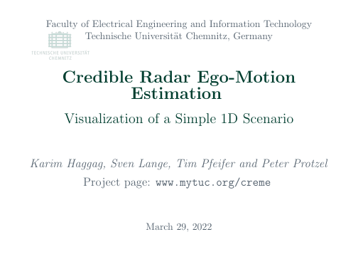

# Credible Radar Ego-Motion Estimation (creme)
Currently, creme is implementing various evaluation scenarios described within the corresponding publication; see "Citation" below and our [project's landing page](https://mytuc.org/creme).
The provided source code depends on the [libMix4SAM](https://github.com/TUC-ProAut/libmix4sam) library, which itself extends the functionality of GTSAM [1].

<p align="center">
<kbd>

</kbd>
</p>

## Contact information
- [Sven Lange](https://www.tu-chemnitz.de/etit/proaut/sven_lange)
- [Karim Haggag](https://www.tu-chemnitz.de/etit/proaut/en/team.html)
- [Tim Pfeifer](https://www.tu-chemnitz.de/etit/proaut/tim_pfeifer)

## License information
creme is free software: you can redistribute it and/or modify
it under the terms of the GNU General Public License as published by
the Free Software Foundation, either version 3 of the License, or
(at your option) any later version.

creme is distributed in the hope that it will be useful,
but WITHOUT ANY WARRANTY; without even the implied warranty of
MERCHANTABILITY or FITNESS FOR A PARTICULAR PURPOSE. See the
GNU General Public License for more details.

You should have received a copy of the GNU General Public License
along with this software. If not, see <http://www.gnu.org/licenses/>.

## Citation

If you use this library for academic work, please either cite the library or a corresponding paper:
<details>
<summary>BibTeX of creme</summary>

```tex
  @Misc{creme,
   author       = {Sven Lange, Karim Haggag and Others},
   title        = {creme},
   howpublished = {\url{https://github.com/TUC-ProAut/creme}}
  }
```

</details>

<details>
<summary>Accompanying Paper</summary>

* Haggag, Karim, Sven Lange, Tim Pfeifer, and Peter Protzel (2022) 'A Credible and Robust approach to Ego-Motion Estimation using an Automotive Radar’. [DOI: 10.1109/LRA.2022.3162644](https://dx.doi.org/10.1109/LRA.2022.3162644) (early access, to appear in IEEE Robotics and Automation Letters)

</details>

## Installation
The following subsections describe how to compile and/or install the needed dependencies for running the experiments.

<details>
<summary>GtSAM and libMix4SAM</summary>

Please follow the readme for [libMix4SAM](https://github.com/TUC-ProAut/libmix4sam).
</details>

<details>
<summary>ICP Implementation</summary>

For running our ICP implementation with additional covariance, the corresponding Matlab Wrapper has to be compiled. 
Therefore, please run the Matlab-Script `make.m` from within its folder `modules/icp_cov/matlab`.
Depending on the system's current OS and Matlab version, there may be some changes to this script necessary. 
Please follow the provided comments within the script.
</details>

<details>
<summary>nuScenes Integration</summary>

This step is necessary for the 4th experiment using the nuScenes dataset.
For first experiments, we recommend using only the *Mini* dataset. 
Further experiments can be done using the *Trainval* dataset.

1. Download one or both datasets at the [nuScenes webpage](https://www.nuscenes.org/download): <br>
   After login, you will find the needed files under the heading *Full dataset (v1.0)*.
2. Extract the files, e.g., into `~/datasets/nuscenes`.
3. Download or clone the [nuscenes-devkit](https://github.com/nutonomy/nuscenes-devkit) repository.
4. Install the devkit by using one of the [possible methods](https://github.com/nutonomy/nuscenes-devkit/blob/master/docs/installation.md). 
5. Additional to the nuScenes package itself, our Matlab implementation needs *PCL-Tools* to convert the provided point-clouds into ASCII format to be used within Matlab. Install it in Ubuntu, e.g., by using apt:
   ```bash
   ❯ sudo apt install pcl-tools
   ```
</details>

<details>
<summary>Using rpg_trajectory_evaluation</summary>

In the supplementary material to our publication, we also evaluated the mobile robot dataset with the [rpg_trajectory_evaluation tool](https://github.com/uzh-rpg/rpg_trajectory_evaluation).
To redo this evaluation, the rpg_trajectory_evaluation tool has to be installed, e.g., using miniconda as it depends on Python 2.

Running the `e3SummitRadarPlot.m` script will create an additional folder called `Robo` within the configured results folder.
There, the needed input files and folder structure for the rpg_trajectory_evaluation can be found.
Also, the configuration file is generated, called `e3_summit.template.yaml`, which should be copied to the tool's folder `rpg_trajectory_evaluation/analyze_trajectories_config`.
It can be necessary to replace some characters not supported by the tool, e.g., `_` for the label of the algorithm.
</details>

## Experiments
In the following, we list the experiments according to the accompanying publication.
Details regarding start and dependencies are given.

### A. Simulated Point Set Registration
Run the script `e1Psr2DProblem.m` and continue with `e1Psr2DProblemPlot.m`.

### B. Simulated Radar
Run the script `e2SimulatedRadar.m` and continue with `e2SimulatedRadarPlot.m`.

### C. Mobile Robot Dataset
Download the dataset `e3Data.zip` from the [project's landing page](https://mytuc.org/creme) and extract it into the `creme` folder. Then, run the script `e3SummitRadar.m` and continue with `e3SummitRadarPlot.m`.

### D. nuScenes
Make sure, you followed the additional installation process for using the nuScenes data.

For the evaluation of the ***mini*-dataset**, start executing the script `e4NuScenesInit` once -- please make sure, to adapt the code to your path structure first.
Afterwards, the script `e4NuScenes.m` can be run to do the evaluation.
For plotting, use the function `e4NuScenesPlot(.)` to get combined or single results.
Single results for multiple scenes can be created with `e4NuScenesPlotGenerator(.)`.

Further, the evaluation scripts for the ***trainval*-dataset** are located within the folder `e4Trainval`.
Four steps (see file naming) have to be done, to generate the results. 

## References

[1] GTSAM 4.0 https://gtsam.org


